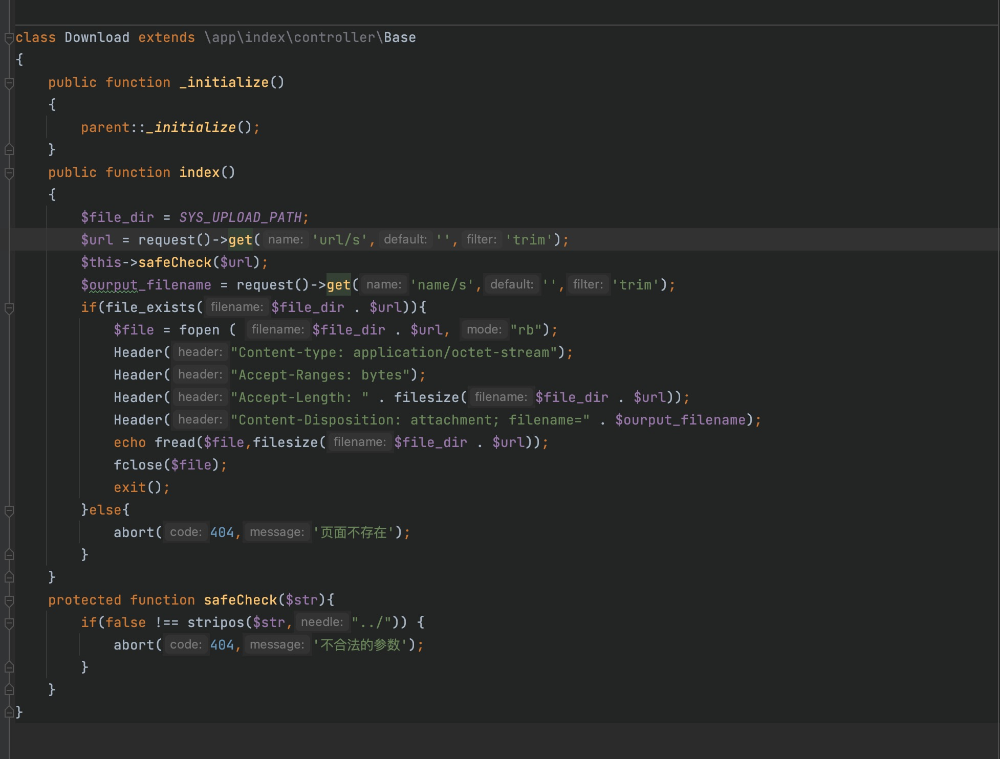
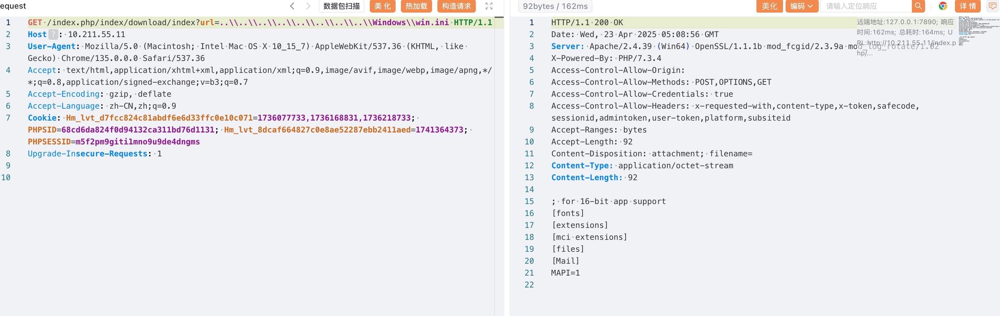
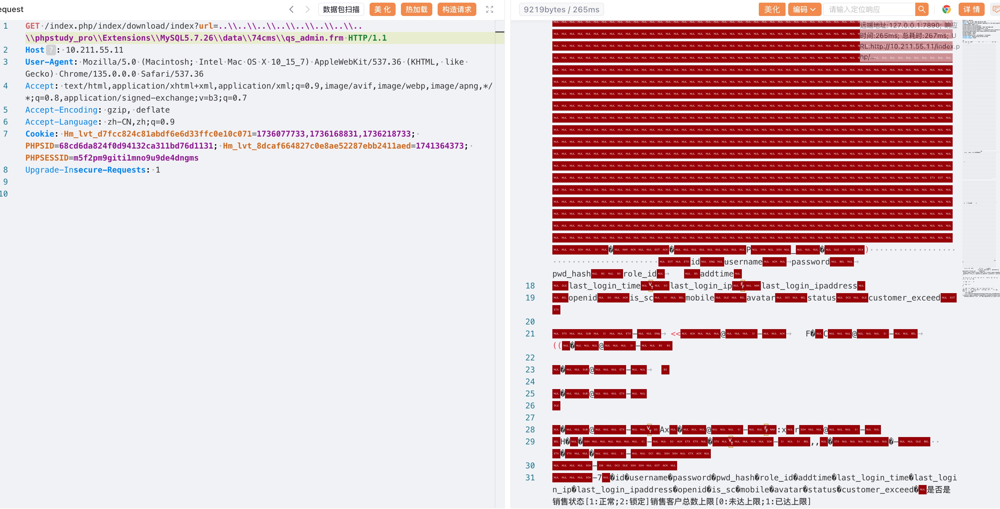
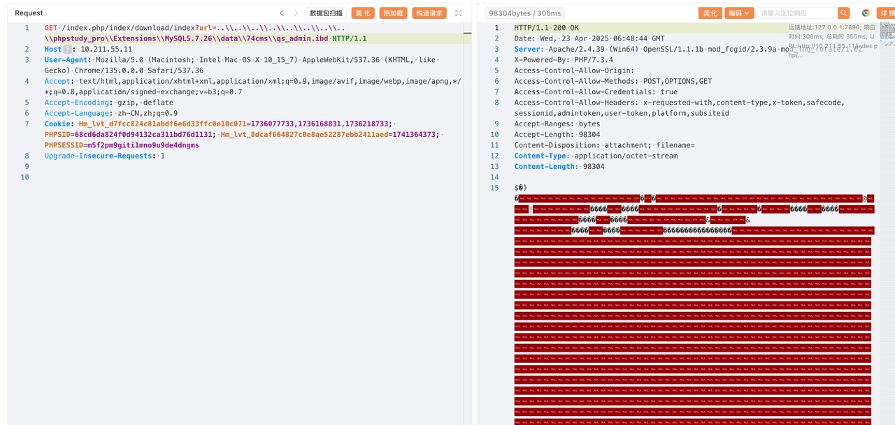

# Discoverer
```text
sheizhu ssa.to,yaklang.io
```
# env

```text
https://www.74cms.com/download/detail/175.html
```
# version
74cms <= 3.33.0
# detail

The code is as follows, in the filtering, only the filtering is filtered out '../', no filtering for windows "..\\\\"


The vulnerability proved that the win.ini file of Windows was successfully read


Arbitrary file reads cause any user to log in to > background RCE.

Because there are arbitrary files read by Windows, my project is based on phpstudy, and the project is based on MySQL, a possible path is /var/lib/mysql/data/74cms.
Because MySQL persistence is stored in a file, you can download the data in the MySQL 74cms library, then open a database, and cp it to the local database directory for viewing.
The proof of the vulnerability is as follows


