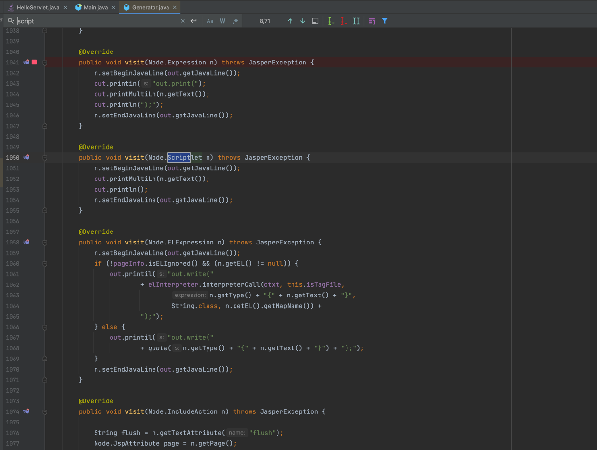
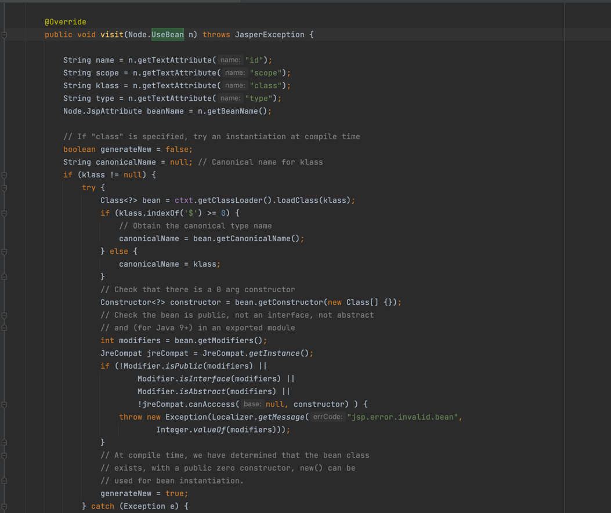

# tomcat jsp generate bypass

# config

```text
tomcat 8.5.47
```

## generate java progress

```text
(1) Pre-parse Opcode, mainly to parse import, include, taglib, etc

(2) Iterate the AST syntax tree for verification

(3) Formal parsing of Opcode, mainly to some tags, such as <%%>, <%! %> to parse

(4) Iterate the AST syntax tree for verification

(5) Traverse the AST syntax tree to generate java code


```

Because the AST implementation is mostly implemented through generateVisitor, in fact, if you look closely at this code, you can see that it is written through stringBuilder and finally generated through StringBuilder java code



If the checksum fails, throw error will not generate a.java file, but some checksum is more strict, some checksum is more loose. Only one successful case will be mentioned here



You see here that id, scope, and so on are written to the stringWriter

That is to say, when I have malicious characters to close, it may lead to malicious code execution (careful observation will find that there are many parts written).

We have no control over what is written and where it is generated, and the Script(<%%>) is generated at the end, so we can close it manually.


```jsp
<jsp:useBean id="a=null;java.lang.Runtime.getRuntime().exec(\"open -a calculator\");/*" class="org.aa.test"/>  
  
<%*/out.print(1);%>
```

# Tip:
（1）The class in usebean is defined